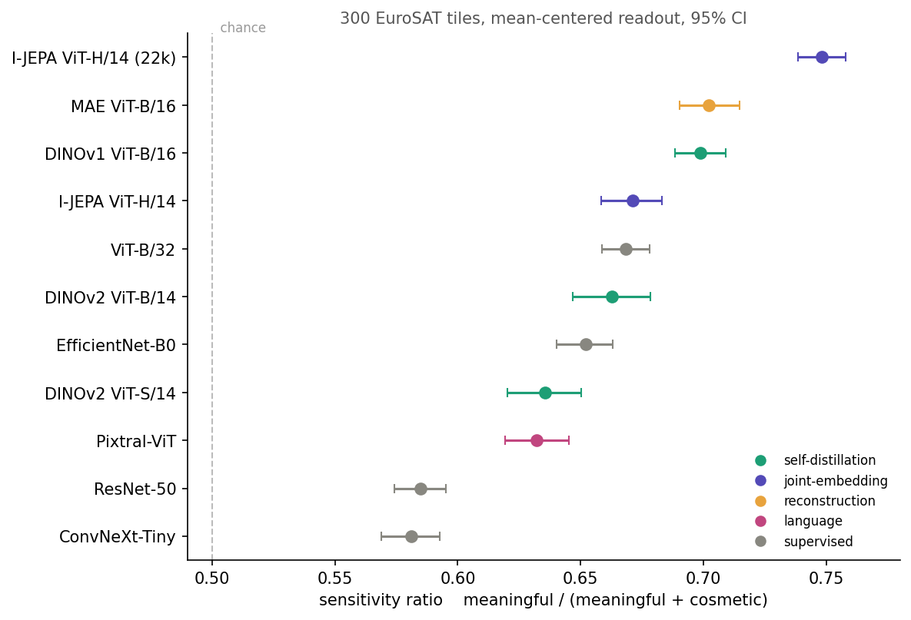
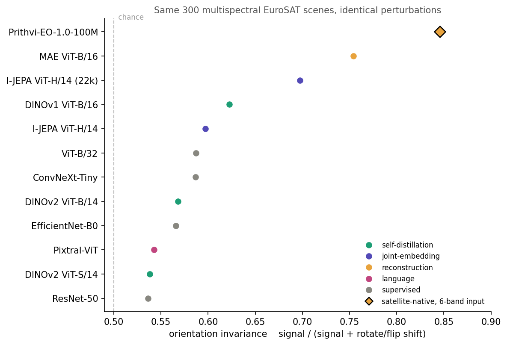

# perception-gap

Do frozen vision encoders trained on photographs tell meaningful satellite changes from cosmetic ones?



Eleven encoders on 300 [EuroSAT](https://arxiv.org/abs/1709.00029) tiles, one number each, plus a satellite-native twelfth on the multispectral version of the same dataset in a second notebook. Every tile gets perturbed two ways that change what is in it, blank the centre and shuffle the patch layout, and three ways that do not, rotate 90 degrees, flip vertically, add magnitude matched noise. Then measure how far the frozen representation moves in each case. The sensitivity ratio is

```
SR = meaningful shift / (meaningful shift + cosmetic shift)
```

1.0 is an encoder that only reacts to content, 0.5 is one that cannot tell content from cosmetics, below 0.5 means noise moves it more than signal. Shifts are cosine distances in the mean-centered subspace, for reasons that turned out to matter a lot and get their own section below. Nothing is trained and nothing is finetuned. The experiment is about 220 lines and reruns bit for bit on a fresh runtime.

Short answer: every encoder lands above chance, none is anywhere near 1.0, I-JEPA trained on more data is the best of them, the two encoders that first looked completely dead were an artifact of how I was reading them, and the satellite-native model is far more orientation-invariant than anything trained on photos.

## results

| model | objective | pretrain data | SR | 95% CI | signal | cosmetic |
|---|---|---|---|---|---|---|
| I-JEPA ViT-H/14 (22k) | joint-embedding | IN-22K | 0.748 | 0.739, 0.758 | 0.386 | 0.130 |
| MAE ViT-B/16 | reconstruction | IN-1K | 0.702 | 0.690, 0.715 | 0.092 | 0.039 |
| DINOv1 ViT-B/16 | self-distillation | IN-1K | 0.699 | 0.688, 0.709 | 0.295 | 0.127 |
| I-JEPA ViT-H/14 | joint-embedding | IN-1K | 0.671 | 0.658, 0.683 | 0.285 | 0.140 |
| ViT-B/32 | supervised | IN-1K | 0.668 | 0.659, 0.678 | 0.290 | 0.144 |
| DINOv2 ViT-B/14 | self-distillation | LVD-142M | 0.663 | 0.647, 0.678 | 0.228 | 0.116 |
| EfficientNet-B0 | supervised | IN-1K | 0.652 | 0.640, 0.663 | 0.264 | 0.141 |
| DINOv2 ViT-S/14 | self-distillation | LVD-142M | 0.636 | 0.620, 0.650 | 0.222 | 0.127 |
| Pixtral-ViT | language | image-text | 0.632 | 0.619, 0.645 | 0.357 | 0.208 |
| ResNet-50 | supervised | IN-1K | 0.585 | 0.574, 0.595 | 0.206 | 0.147 |
| ConvNeXt-Tiny | supervised | IN-22K | 0.581 | 0.569, 0.593 | 0.247 | 0.178 |

Three things worth pulling out. Scaling I-JEPA from ImageNet-1K to 22K moves it from 0.671 to 0.748 with non overlapping intervals, so more pretraining data measurably improves calibration for the same objective. The two convolutional nets sit at the bottom. And Pixtral-ViT, Mistral's own encoder and the only one here trained purely by predicting text, is mid pack, which is mildly interesting given it never saw a classification label.

## the satellite-native comparison

Everything above is a photo model pointed at satellite RGB. [Prithvi-EO-1.0](https://arxiv.org/abs/2310.18660), from NASA and IBM, is the opposite: a masked autoencoder pretrained on satellite imagery that eats six HLS bands rather than three. `prithvi.ipynb` runs it on the multispectral version of EuroSAT, then runs the same eleven photo encoders on RGB extracted from those identical tiles, so all twelve see the same scenes under the same perturbations.



Prithvi's per-perturbation shifts:

| perturbation | kind | shift |
|---|---|---|
| occlude_center | meaningful | 0.0145 |
| scramble_patches | meaningful | 0.0910 |
| rotate_90 | cosmetic | 0.0110 |
| flip_vertical | cosmetic | 0.0082 |
| matched_noise | cosmetic | 0.4251 |

Overall SR 0.263 with a 95% interval of 0.235 to 0.291. Almost all of that comes from one perturbation: matched noise is 95.7% of the entire cosmetic response, 39 times the rotation shift. Take noise out and Prithvi's orientation invariance is 0.846, the highest of all twelve, against 0.754 for the next best and a median of 0.57 for the photo models. Its raw geometry shift is 0.0096, twenty times flatter than the median photo encoder. That is what a model trained on overhead imagery should look like: there is no canonical up in a satellite tile, and Prithvi learned it while the photo models never did.

The geometry axis is the one fully fair comparison in the repo. Rotation and vertical flip are exact pixel operations, so there is no magnitude to match, no scaling divisor, no normalisation asymmetry. Everything else on this axis is measured identically for every model. That is why it gets a figure and the noise-inclusive SR does not.

Two cross-checks fall out of running both renderings of the same dataset. Signal magnitude, how far each encoder moves for a meaningful change, correlates at r = 0.946 between the main notebook and the shared-tile run, with ten of eleven models within 9%. So the meaningful response is a property of the encoder, not of the preprocessing. And the model ordering survives: rank correlation between the main notebook's SR and the shared-tile orientation invariance is +0.845. Include noise and it collapses to +0.064, because noise sensitivity depends heavily on image contrast and the multispectral-derived RGB is much flatter than the pre-stretched EuroSAT RGB. The scaling effects replicate too. I-JEPA 1k to 22k improves by +0.077 in the main notebook and +0.101 here; DINOv2 S to B by +0.027 and +0.030.

## install

```
pip install -r requirements.txt
```

The last two lines of `requirements.txt` belong to `prithvi.ipynb` alone. Do not install them into a kernel that is already running the rest: terratorch replaces numpy underneath and nothing imports cleanly until the kernel restarts. That notebook installs them itself and then restarts on purpose.

Everything runs on a single T4, which is what Colab gives away. Expect the download of twelve checkpoints to dominate the wall clock, roughly 20 GB, and the measurement itself to take a few minutes per model.

## run

`perception-gap.ipynb` is five cells: install, the experiment, the figure, the readout diagnostic, and the all-but-the-top sweep. It writes `results/sr_by_model.csv` and `results/shift_by_perturbation.csv`.

`prithvi.ipynb` is four cells and needs a fresh runtime, because terratorch swaps numpy under a running kernel and only a restart clears it. The first cell installs and then kills the kernel on purpose. Run it, wait for the crash, then run the rest without touching the first cell again.

`test_metric.py` is separate from both notebooks. It checks the metric against a synthetic encoder with a deliberately planted bias, where the correct answer is known in advance: that the compression matches `1/(rho^2+1)`, that SR survives centering, that a buried signal comes back off the floor, and that an encoder with no shared bias is left alone. Run it with `python test_metric.py`. It validates the algorithm rather than the notebook's copy of it.

Outputs are committed, so you can read every result without running anything.

## why the readout is centered

This changed the result, so it gets its own section.

Write an encoder's feature vector as a shared part plus an input specific part, `h(x) = mu + v(x)`, where `mu` is the mean over the dataset. Let

```
rho^2 = ||mu||^2 / E||v||^2
```

which is how much of the vector is a constant direction every input shares. Assuming the informative parts are roughly orthogonal to `mu` on average, which holds because `v` is mean zero by construction, the raw cosine shift under a perturbation relates to the centered one as

```
d_raw = d_centered / (rho^2 + 1)
```

A dominant shared direction compresses every shift by the same factor. Signal and noise get compressed equally, so SR itself barely changes, but the absolute shifts can be squashed far enough to hit the measurement floor, at which point the ratio is noise over noise and means nothing. That is exactly what happened. MAE and Pixtral-ViT both came back with shifts near zero and got flagged inert. Both were fine once the mean was removed. MAE's signal went from 0.004 to 0.092, a factor of 22.

The readout diagnostic checks this, measured rather than assumed:

| model | rho^2 | predicted 1/(rho^2+1) | observed | SR raw | SR centered |
|---|---|---|---|---|---|
| DINOv2 ViT-S/14 | 0.76 | 0.567 | 0.541 | 0.628 | 0.636 |
| MAE ViT-B/16 | 6.96 | 0.126 | 0.044 | 0.717 | 0.702 |

The prediction the experiment rests on holds: SR drifts only 0.008 and 0.015 under centering, because the compression factor cancels in the ratio. The scalar law itself is quantitatively right only for the encoder with little shared bias. DINOv2 lands within 5%. For MAE it under-predicts the compression by a factor of about three, since explaining the observed 0.044 would need rho^2 near 22 and the measured value is 7.0.

Centering is the first step of all-but-the-top ([Mu and Viswanath 2018](https://arxiv.org/abs/1702.01417)). The underlying geometry is the anisotropy story from NLP: representations concentrate in a narrow cone so unrelated vectors already look similar ([Ethayarajh 2019](https://arxiv.org/abs/1909.00512)), and a handful of rogue dimensions dominate cosine similarity and hide representational quality ([Timkey and van Schijndel 2021](https://arxiv.org/abs/2109.04404)). None of that is new. What this repo adds is the statement for perturbation displacement rather than pairwise similarity, and a test of how far the correction should be taken.

## how far to strip

The all-but-the-top sweep runs that test, and the answer is that the mean is where you stop.

Stripping the leading principal directions as well as the mean does recover more. MAE's single top direction holds 81.6% of the variance across scenes while carrying only 5.9% of the perturbation displacement, and two directions hold 93.1% against 7.2%. That is what a rogue dimension looks like and it accounts for the factor of three above: the effective bias is the mean plus roughly one direction, and once you count it that way the predicted and observed compression cross over between k=1 and k=2.

But it also breaks the measurement. SR drifts monotonically as directions come off, and MAE slides from 0.702 at k=0 to 0.561 at k=32, nearly the full spread of the eleven model table. Decompose it and the reason is clear: MAE's signal grows 7.6x across the sweep while its cosmetic response grows 14x, so the stripped directions were carrying disproportionately meaningful response rather than none of it. DINOv2 drifts too, 0.636 to 0.591, so this is not specific to bias-heavy encoders.

In word embeddings the leading directions encode frequency artifacts, which is why removing them helps. Here they encode scene content, so removing them deletes the thing being measured. Same linear algebra, opposite semantics. The mean is a tested boundary, not a preference.

## what did not work

Most of the work here was catching my own bugs. Five times a striking result turned out to be the instrument rather than the model.

**I-JEPA looked like the worst encoder, and it is actually the best.** Early on it scored around 0.47 and the headline was going to be that the biggest model was the worst calibrated. It was being fed through a lossy round trip that none of the others got: un-normalise the tensor, squash to an 8 bit image, re-process. Feeding it the identical normalised tensor flipped it from bottom to top. Separately, an earlier attempt loaded the weights with `strict=False`, which silently keeps randomly initialised layers when the checkpoint does not match, and another attempt grabbed the V-JEPA video model by mistake and averaged away the time dimension to make it fit. Both produced plausible looking numbers. The Pixtral loader asserts on missing keys for exactly this reason.

**The numbers drifted between runs.** Perturbations were generated per model with no fixed seed, so no two encoders were compared on the same perturbed tiles. Generating the perturbation set once, seeded, and reusing it for every model made the whole fleet reproduce bit for bit. The bootstrap gets its own separate generator so the intervals are stable too.

**MAE and Pixtral looked inert.** Covered above. "Inert" was a property of the readout, not the encoder, and it only surfaced because Pixtral tripped the same flag and made the coincidence too suspicious to ignore.

**Blacking out the centre measured the wrong thing.** The first occlusion filled with zeros, which after ImageNet normalisation is a pixel value the encoder has essentially never seen, so part of the meaningful shift was the model reacting to out of distribution pixels rather than to missing content. It now fills with the tile's own per channel mean. In the same spirit, the noise perturbation was originally not magnitude matched to the occlusion, which made the two families different sizes in pixel space and quietly inflated SR.

**Prithvi did not reproduce across terratorch versions.** The first version read `out[-1]` from the backbone. Terratorch returns a configurable list of layer outputs and that default has changed between releases, so `out[-1]` was a reference to a position in a list rather than to any particular depth of the network. When the list length changed, the readout silently moved to a shallower layer, and SR went from 0.486 to 0.332 on identical tiles. The fix is to hook the final transformer block directly, which is a reference to a specific layer that cannot drift, and to print the terratorch version and the normalisation constants so any future drift is visible. Pinned that way it reproduces bit for bit across fresh runtimes.

Things that got cut and why: a per class destruction analysis, does occluding a city hurt more than a forest, and a representation diversity cell, both post hoc and too small to say anything; a colour jitter perturbation, dropped because it is a DINOv2 training augmentation and so tests learned invariance rather than calibration; and a layer by layer linear probe showing DINOv2 reads EuroSAT land use best in its middle layers at about 94.8% held out accuracy, which is real and reproducible but is a different experiment from this one and muddied the repo.

## decisions

- **300 tiles, RGB for the main run.** EuroSAT ships a multispectral version but ten of the eleven photo encoders only accept three channels, and the point is to test repurposed photo models on satellite data.
- **Each encoder is read at its own standard pooled output**, then centered. Mean pooled patch tokens for DINOv2, I-JEPA and Pixtral, the CLS token for DINOv1, timm's default for MAE, global average pooling for the convolutional nets, and the hooked final block mean-pooled for Prithvi. That is the off the shelf feature a practitioner would actually use, rather than one identical pooling rule imposed on all twelve. Defensible, but not the only choice.
- **SR averages the per perturbation means**, so each perturbation type carries equal weight rather than each sample. Two meaningful, three cosmetic.
- **The inert flag fires below 0.02 absolute signal**, where SR is noise divided by noise and should not be read. Nothing trips it under the centered readout, which is the point.
- **In the shared-tile run, perturbation happens in 6-band space and RGB is extracted afterwards**, so every model sees the same physical change to the same scene. RGB is stretched by a single global divisor computed once from the unperturbed tiles. It has to be global: a per-image stretch would let the occlusion change its own normalisation.
- **The two notebooks are not comparable to each other.** Different tile samples and different RGB renderings. Quote the main notebook for the eleven and the shared-tile notebook only for within-run comparisons.

## limitations

The occlusion and the noise are magnitude matched to each other, but rotation and flipping are exact pixel operations that cannot be magnitude matched at all, so "all perturbations are the same size" was never fully true and is not claimed anywhere.

In the shared-tile run the photo models receive noise at roughly 33% of their input's spatial standard deviation while Prithvi receives 25% under its own normalisation, so the noise axis slightly favours Prithvi, which is the axis it wins. Do not read Prithvi's low noise shift as robustness. The geometry axis has no such asymmetry, which is why the conclusions live there.

Matched noise adds independent Gaussian noise to each band. For an RGB encoder that is a texture perturbation. For a multispectral model it also scrambles the ratios between bands, and inter-band spectral signature is a large part of what a satellite foundation model reads, so the same perturbation is arguably not equally cosmetic across the two modalities.

Also: one dataset, one resolution, 300 tiles. SR is an intrinsic property of the representation and has not been tied to any downstream task, so it is not established that a high SR predicts better transfer to real change detection, which is the obvious next thing to check. The centering is principled and provably harmless for encoders without a dominant bias, but it is still a choice, and it changed two conclusions relative to the raw readout: MAE is not dead, and I-JEPA's lead is real but smaller than the raw numbers flattered it to. Reproducibility of the Prithvi notebook is pinned to terratorch 1.2.10.

## references

Dataset and encoders, in the order they appear in the code: [EuroSAT](https://arxiv.org/abs/1709.00029), [ViT](https://arxiv.org/abs/2010.11929), [ResNet](https://arxiv.org/abs/1512.03385), [EfficientNet](https://arxiv.org/abs/1905.11946), [ConvNeXt](https://arxiv.org/abs/2201.03545), [MAE](https://arxiv.org/abs/2111.06377), [DINO](https://arxiv.org/abs/2104.14294), [DINOv2](https://arxiv.org/abs/2304.07193), [I-JEPA](https://arxiv.org/abs/2301.08243), [Pixtral](https://arxiv.org/abs/2410.07073), [Prithvi-EO-1.0](https://arxiv.org/abs/2310.18660). Tooling: [TorchGeo](https://arxiv.org/abs/2111.08872) for multispectral EuroSAT, [TerraTorch](https://github.com/IBM/terratorch) for Prithvi.

Readout geometry: [Mu and Viswanath 2018](https://arxiv.org/abs/1702.01417), [Ethayarajh 2019](https://arxiv.org/abs/1909.00512), [Timkey and van Schijndel 2021](https://arxiv.org/abs/2109.04404). On objectives shaping representations and the CLS versus pooling question, [Objectives Matter](https://arxiv.org/abs/2304.13089) covers the ground this repo walks over. Linear probing as a method goes back to [Alain and Bengio 2017](https://arxiv.org/abs/1610.01644).

## license

MIT
